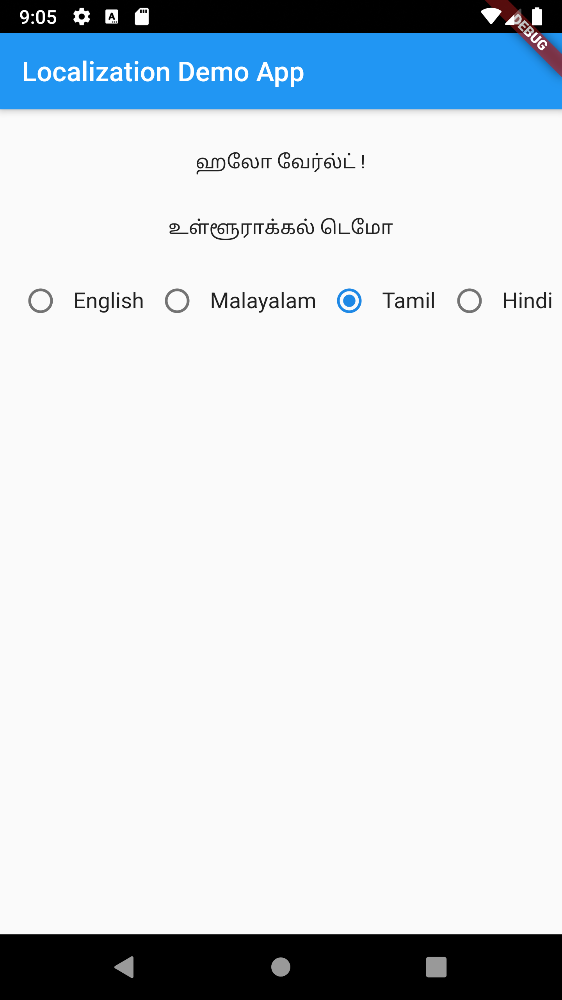
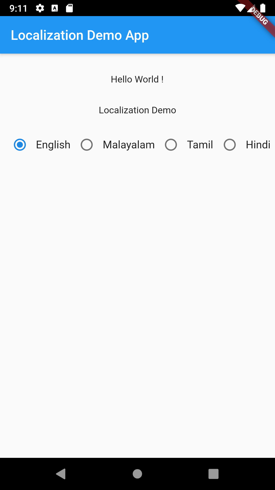
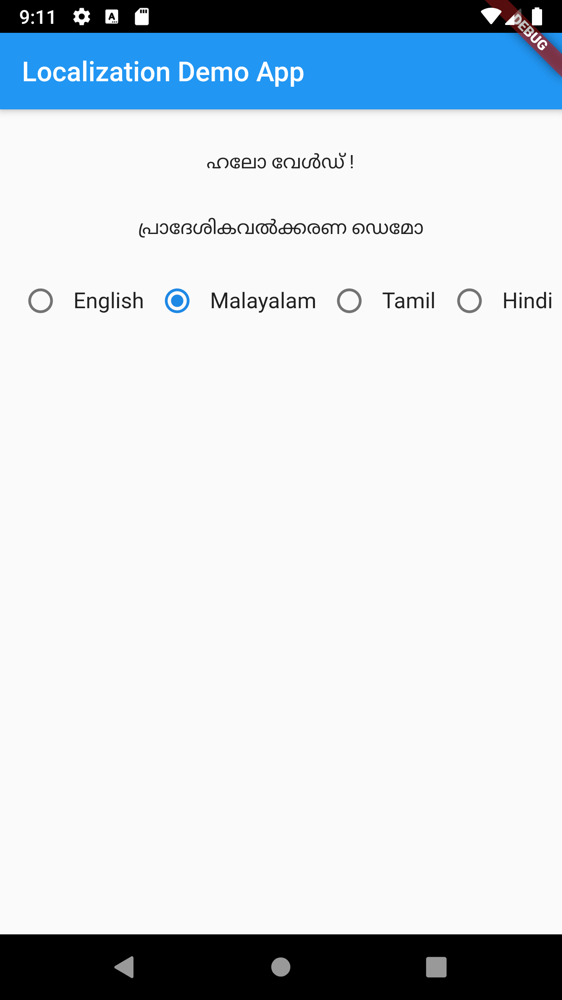

# localization_demo

I18N support from server content.

## Getting Started

# Required packages
* sembast: ^2.4.8+1
* provider: ^4.3.2+3
* path_provider: ^0.5.0+1
* http: ^0.12.2
* shared_preferences: ^0.5.10 

# How to use

1) Replace `i18nURL` value in file `i18n/services/i18n_service.dart` 
API response should be like as follows

    ```{
      "version": 1,
      "content": [
        {
          "language": "English",
          "translate": {
            "Hello World !": "Hello World !",
            "Localization Demo": "Localization Demo",
          }
        },
        {
          "language": "Malayalam",
          "translate": {
            "Hello World !": "ഹലോ വേൾഡ് !",
            "Localization Demo": "പ്രാദേശികവൽക്കരണ ഡെമോ",
          }
        },
        {
          "language": "Tamil",
          "translate": {
            "Hello World !": "ஹலோ வேர்ல்ட் !",
            "Localization Demo": "உள்ளூராக்கல் டெமோ",
          }
        },
        {
          "language": "Hindi",
          "translate": {
            "Hello World !": "नमस्ते दुनिया !",
            "Localization Demo": "स्थानीयकरण डेमो",
          }
        }
      ]
    }

2) Add `LanguageProvider` to your providers list like as follows

    MultiProvider(
      providers: [
        ChangeNotifierProvider(create: (_) => LanguageProvider()),
      ],
      child: MyApp(),
    )
    
3) Use `TextLocalization` widget instead of `Text` widget.

    TextLocalization('Hello World !')
    
4) For complex case use `LocalizationBuilder` widget

    LocalizationBuilder(
                      'Hello world !',
                      builder: (BuildContext context, String value) {
                        return Text(value);
                      },
                    )


# Screenshots

<p align="center">
    
    
    
</p>
